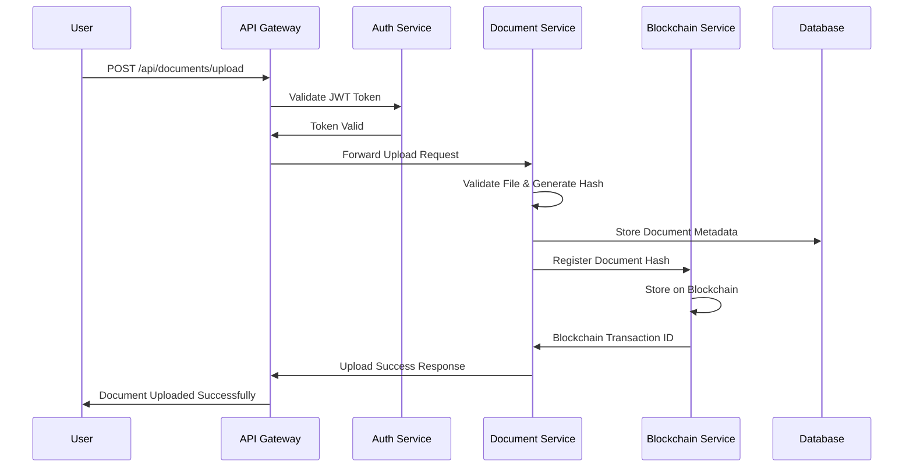
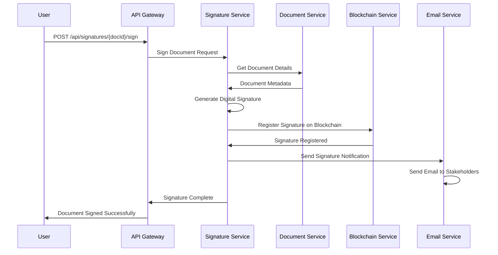
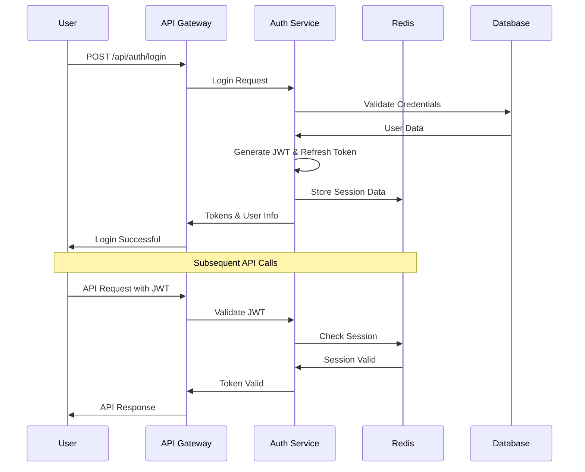

# 🔐 VerSafe - Blockchain Document Signing Platform

[](https://opensource.org/licenses/MIT)
[](https://www.docker.com/)
[](https://microservices.io/)
[](https://hyperledger.org/use/fabric)
[](https://scikit-learn.org/)
[](https://reactjs.org/)

## 📁 Repository Structure

```
BlockchainDocumentSigning/
├── 📂 backend/              # 7 Microservices Backend
│   ├── auth-service/        # User authentication & JWT management
│   ├── document-service/    # Document upload, storage & AI integration
│   ├── signature-service/   # Digital signatures & verification
│   ├── email-service/       # Email notifications & sharing
│   ├── profile-service/     # User profile management
│   ├── blockchain-service/  # Hyperledger Fabric integration
│   ├── ai/                  # AI-powered PDF malware detection
│   ├── nginx/               # API Gateway configuration
│   ├── database/            # PostgreSQL schema & initialization
│   ├── tests/               # Comprehensive testing suite
│   └── docker-compose.yml   # Container orchestration
├── 📂 frontend/             # React TypeScript Application
│   ├── src/                 # Source code
│   │   ├── components/      # Reusable UI components (50+)
│   │   ├── pages/           # Application pages
│   │   ├── contexts/        # React context providers
│   │   ├── hooks/           # Custom React hooks
│   │   └── types/           # TypeScript type definitions
│   ├── public/              # Static assets
│   └── package.json         # Frontend dependencies
├── 📂 docs/                 # Comprehensive Documentation
│   ├── API_DOCUMENTATION.md           # Complete API reference
│   ├── FRONTEND_BACKEND_INTEGRATION.md # Developer integration guide
│   ├── DEPLOYMENT_GUIDE.md            # Production deployment
│   └── PROJECT_SUMMARY.md             # Architecture overview
└── 📄 README.md             # This file
```

## 🌟 Overview

VerSafe is a cutting-edge, enterprise-grade blockchain document signing platform built with modern microservices architecture. It provides secure document storage, AI-powered security analysis, digital signatures, blockchain verification, and comprehensive audit trails for organizations requiring the highest levels of document security and compliance.

### 🎯 Key Features

- **🔐 Secure Authentication** - JWT-based authentication with refresh tokens
- **📄 Document Management** - Upload, store, and manage documents with metadata
- **✍️ Digital Signatures** - Electronic document signing with cryptographic verification
- **⛓️ Blockchain Integration** - Immutable document registration using Hyperledger Fabric
- **📧 Email Notifications** - Automated email system for document workflows
- **👤 User Profiles** - Comprehensive user profile management with avatar support
- **🌐 API Gateway** - Nginx-based load balancing and routing
- **📊 Comprehensive Testing** - Full integration test suite
- **🐳 Docker Containerization** - Complete containerized deployment
- **📈 Scalable Architecture** - Microservices design for horizontal scaling

## 🏗️ Architecture Overview

VerSafe follows a microservices architecture pattern with the following components:

```
┌─────────────────┐    ┌─────────────────┐    ┌─────────────────┐
│   Frontend      │    │   API Gateway   │    │   Load Balancer │
│   (React/Vue)   │◄──►│   (Nginx)       │◄──►│   (Optional)    │
└─────────────────┘    └─────────────────┘    └─────────────────┘
                                │
                ┌───────────────┼───────────────┐
                │               │               │
        ┌───────▼──────┐ ┌──────▼──────┐ ┌─────▼──────┐
        │ Auth Service │ │ Doc Service │ │ Sig Service│
        │   :3001      │ │   :3002     │ │   :3003    │
        └──────────────┘ └─────────────┘ └────────────┘
                │               │               │
        ┌───────▼──────┐ ┌──────▼──────┐ ┌─────▼──────┐
        │Email Service │ │Profile Svc  │ │Blockchain  │
        │   :3004      │ │   :3005     │ │   :3006    │
        └──────────────┘ └─────────────┘ └────────────┘
                │               │               │
                └───────────────┼───────────────┘
                                │
                    ┌───────────▼───────────┐
                    │     Database Layer    │
                    │  PostgreSQL + Redis   │
                    └───────────────────────┘
```

## 🚀 Quick Start

### Prerequisites

- **Docker** & **Docker Compose** installed
- **Node.js** 18+ (for running tests)
- **Git** for version control
- **4GB+ RAM** recommended

### 🔧 Installation

1. **Clone the repository:**
```bash
git clone <repository-url>
cd ver-safe
```

2. **Start the services:**
```bash
cd backend
docker-compose up -d
```

3. **Verify services are running:**
```bash
docker-compose ps
```

4. **Run the integration tests:**
```bash
npm install axios form-data
node test-all-services.js
```

### 🌐 Service Endpoints

| Service | Port | Health Check | Description |
|---------|------|--------------|-------------|
| **API Gateway** | 80/443 | `http://localhost/health` | Nginx reverse proxy |
| **Auth Service** | 3001 | `http://localhost:3001/health` | Authentication & authorization |
| **Document Service** | 3002 | `http://localhost:3002/health` | Document management |
| **Signature Service** | 3003 | `http://localhost:3003/health` | Digital signatures |
| **Email Service** | 3004 | `http://localhost:3004/health` | Email notifications |
| **Profile Service** | 3005 | `http://localhost:3005/health` | User profile management |
| **Blockchain Service** | 3006 | `http://localhost:3006/health` | Blockchain integration |

## 📋 Detailed Service Documentation

### 🔐 Authentication Service (Port 3001)

**Purpose:** Handles user authentication, authorization, and JWT token management.

**Key Features:**
- User registration and login
- JWT token generation and validation
- Refresh token mechanism
- Password hashing with bcrypt
- Redis session management

**API Endpoints:**
```
POST /api/auth/register     - User registration
POST /api/auth/login        - User login
POST /api/auth/refresh      - Refresh JWT token
POST /api/auth/logout       - User logout
GET  /api/users/me          - Get current user info
PUT  /api/users/me          - Update user info
```

**Environment Variables:**
```env
JWT_SECRET=your-super-secret-jwt-key-change-in-production
JWT_EXPIRES_IN=1h
REFRESH_TOKEN_EXPIRES_IN=7d
BCRYPT_ROUNDS=12
```

### 📄 Document Service (Port 3002)

**Purpose:** Manages document upload, storage, retrieval, and metadata.

**Key Features:**
- Secure file upload with validation
- Document metadata management
- File type and size restrictions
- Document versioning support
- Integration with blockchain service

**API Endpoints:**
```
POST /api/documents/upload           - Upload document
GET  /api/documents                  - List user documents
GET  /api/documents/:id              - Get specific document
PUT  /api/documents/:id              - Update document metadata
DELETE /api/documents/:id            - Delete document
POST /api/verification/:id/verify    - Verify document integrity
```

**Supported File Types:**
- PDF documents
- Microsoft Office files (docx, xlsx, pptx)
- Images (jpg, png, gif)
- Text files (txt, csv)

### ✍️ Signature Service (Port 3003)

**Purpose:** Handles digital document signing and signature verification.

**Key Features:**
- Electronic signature creation
- Cryptographic signature verification
- Multiple signature types support
- Signature audit trails
- Integration with document service

**API Endpoints:**
```
POST /api/signatures/:documentId/sign    - Sign document
GET  /api/signatures/document/:id        - Get document signatures
POST /api/signatures/:id/verify          - Verify signature
GET  /api/signatures/user/history        - User signature history
```

**Signature Types:**
- **ELECTRONIC** - Basic electronic signature
- **DIGITAL** - Cryptographically secure signature
- **BIOMETRIC** - Biometric-based signature (future)

### 📧 Email Service (Port 3004)

**Purpose:** Manages email notifications and communication workflows.

**Key Features:**
- Template-based email system
- SMTP and Gmail API support
- Email delivery tracking
- Notification preferences
- Audit logging

**API Endpoints:**
```
POST /api/email/send                 - Send general email
POST /api/email/welcome              - Send welcome email
POST /api/email/share-document       - Document sharing notification
POST /api/email/request-signature    - Signature request email
GET  /api/email/logs                 - Email delivery logs
```

**Email Templates:**
- Welcome emails
- Document sharing notifications
- Signature requests
- System alerts
- Password reset emails

### 👤 Profile Service (Port 3005)

**Purpose:** Manages user profiles, preferences, and avatar uploads.

**Key Features:**
- User profile management
- Avatar upload and processing
- Notification preferences
- Privacy settings
- Organization information

**API Endpoints:**
```
GET  /api/profiles/me               - Get current user profile
PUT  /api/profiles/me               - Update user profile
POST /api/profiles/me/avatar        - Upload profile avatar
GET  /api/profiles/me/preferences   - Get user preferences
PUT  /api/profiles/me/preferences   - Update preferences
```

**Profile Fields:**
- Personal information (name, phone, location)
- Professional details (organization, job title)
- Contact preferences
- Privacy settings
- Avatar image

### ⛓️ Blockchain Service (Port 3006)

**Purpose:** Provides blockchain integration for document verification and immutable audit trails.

**Key Features:**
- Hyperledger Fabric integration
- Document hash registration
- Immutable audit trails
- Blockchain verification
- Smart contract interactions

**API Endpoints:**
```
POST /api/blockchain/register        - Register document on blockchain
POST /api/blockchain/verify          - Verify document on blockchain
GET  /api/blockchain/history/:id     - Get document blockchain history
GET  /api/blockchain/network/status  - Get blockchain network status
```

**Blockchain Features:**
- Document hash storage
- Timestamp verification
- Immutable audit trails
- Multi-node consensus
- Smart contract execution

### 🌐 API Gateway (Nginx - Port 80/443)

**Purpose:** Provides unified entry point, load balancing, and security.

**Key Features:**
- Request routing to microservices
- Load balancing
- Rate limiting
- SSL termination
- CORS handling
- Security headers

**Routing Configuration:**
```
/api/auth/*        → auth-service:3001
/api/documents/*   → document-service:3002
/api/signatures/*  → signature-service:3003
/api/email/*       → email-service:3004
/api/profiles/*    → profile-service:3005
/api/blockchain/*  → blockchain-service:3006
```

## 🗄️ Database Schema

### PostgreSQL Tables

#### Users Table
```sql
CREATE TABLE users (
    id UUID PRIMARY KEY DEFAULT gen_random_uuid(),
    email VARCHAR(255) UNIQUE NOT NULL,
    name VARCHAR(255) NOT NULL,
    password_hash VARCHAR(255) NOT NULL,
    is_verified BOOLEAN DEFAULT FALSE,
    created_at TIMESTAMP DEFAULT CURRENT_TIMESTAMP,
    updated_at TIMESTAMP DEFAULT CURRENT_TIMESTAMP
);
```

#### User Profiles Table
```sql
CREATE TABLE user_profiles (
    id UUID PRIMARY KEY DEFAULT gen_random_uuid(),
    user_id UUID REFERENCES users(id) ON DELETE CASCADE,
    first_name VARCHAR(50),
    last_name VARCHAR(50),
    phone VARCHAR(20),
    organization VARCHAR(100),
    job_title VARCHAR(100),
    bio TEXT,
    location VARCHAR(100),
    website VARCHAR(255),
    avatar_url VARCHAR(500),
    timezone VARCHAR(50),
    language VARCHAR(10),
    notification_preferences JSONB,
    privacy_settings JSONB,
    created_at TIMESTAMP DEFAULT CURRENT_TIMESTAMP,
    updated_at TIMESTAMP DEFAULT CURRENT_TIMESTAMP
);
```

#### Documents Table
```sql
CREATE TABLE documents (
    id UUID PRIMARY KEY DEFAULT gen_random_uuid(),
    user_id UUID REFERENCES users(id) ON DELETE CASCADE,
    title VARCHAR(255) NOT NULL,
    filename VARCHAR(255) NOT NULL,
    file_path VARCHAR(500) NOT NULL,
    file_size BIGINT NOT NULL,
    mime_type VARCHAR(100) NOT NULL,
    file_hash VARCHAR(64) NOT NULL,
    security_level VARCHAR(20) DEFAULT 'MEDIUM',
    metadata JSONB,
    blockchain_hash VARCHAR(64),
    is_signed BOOLEAN DEFAULT FALSE,
    created_at TIMESTAMP DEFAULT CURRENT_TIMESTAMP,
    updated_at TIMESTAMP DEFAULT CURRENT_TIMESTAMP
);
```

#### Signatures Table
```sql
CREATE TABLE signatures (
    id UUID PRIMARY KEY DEFAULT gen_random_uuid(),
    document_id UUID REFERENCES documents(id) ON DELETE CASCADE,
    user_id UUID REFERENCES users(id) ON DELETE CASCADE,
    signature_type VARCHAR(20) NOT NULL,
    signature_data TEXT NOT NULL,
    signature_hash VARCHAR(64) NOT NULL,
    metadata JSONB,
    is_verified BOOLEAN DEFAULT FALSE,
    created_at TIMESTAMP DEFAULT CURRENT_TIMESTAMP
);
```

#### Email Logs Table
```sql
CREATE TABLE email_logs (
    id UUID PRIMARY KEY DEFAULT gen_random_uuid(),
    recipient_email VARCHAR(255) NOT NULL,
    subject VARCHAR(255) NOT NULL,
    template_name VARCHAR(100),
    email_data JSONB,
    status VARCHAR(20) NOT NULL,
    message_id VARCHAR(255),
    error_message TEXT,
    sent_at TIMESTAMP DEFAULT CURRENT_TIMESTAMP
);
```

#### Audit Logs Table
```sql
CREATE TABLE audit_logs (
    id UUID PRIMARY KEY DEFAULT gen_random_uuid(),
    timestamp TIMESTAMP DEFAULT CURRENT_TIMESTAMP,
    service_name VARCHAR(50) NOT NULL,
    action VARCHAR(100) NOT NULL,
    method VARCHAR(10) NOT NULL,
    path VARCHAR(255) NOT NULL,
    user_id UUID,
    ip_address INET,
    user_agent TEXT,
    status_code INTEGER,
    duration_ms INTEGER,
    request_size BIGINT,
    response_size BIGINT,
    metadata JSONB
);
```

### Redis Schema

#### Session Storage
```
Key: session:{userId}
Value: {
    "userId": "uuid",
    "email": "user@example.com",
    "lastActivity": "timestamp",
    "permissions": ["read", "write"]
}
TTL: 24 hours
```

#### Refresh Tokens
```
Key: refresh_token:{tokenId}
Value: {
    "userId": "uuid",
    "tokenHash": "hash",
    "expiresAt": "timestamp"
}
TTL: 7 days
```

## 🔧 Configuration

### Environment Variables

#### Global Configuration
```env
# Database
DB_HOST=postgres
DB_PORT=5432
DB_NAME=versafe_db
DB_USER=versafe_user
DB_PASSWORD=versafe_password

# Redis
REDIS_HOST=redis
REDIS_PORT=6379
REDIS_PASSWORD=

# JWT
JWT_SECRET=your-super-secret-jwt-key-change-in-production
JWT_EXPIRES_IN=1h
REFRESH_TOKEN_EXPIRES_IN=7d

# API Keys
INTERNAL_API_KEY=versafe-internal-api-key-2024

# Email Configuration
GMAIL_CLIENT_ID=your-gmail-client-id
GMAIL_CLIENT_SECRET=your-gmail-client-secret
GMAIL_REFRESH_TOKEN=your-gmail-refresh-token

# File Upload
MAX_FILE_SIZE=50MB
ALLOWED_FILE_TYPES=pdf,doc,docx,jpg,png,gif

# Blockchain
FABRIC_NETWORK_NAME=versafe-network
FABRIC_CHANNEL_NAME=versafe-channel
FABRIC_CHAINCODE_NAME=versafe-chaincode
```

## 🔄 Data Flow Diagrams

### Document Upload Flow


### Digital Signature Flow


### Authentication Flow


## 🧪 Testing

### Integration Test Suite

The project includes a comprehensive integration test suite that validates all services:

**Test Coverage:**
- ✅ Service health checks
- ✅ Authentication flow (register, login, token validation)
- ✅ Document management (upload, retrieve, verify)
- ✅ Digital signatures (sign, verify)
- ✅ Email notifications
- ✅ Profile management
- ✅ Blockchain integration
- ✅ API gateway routing

**Running Tests:**
```bash
# Install test dependencies
npm install axios form-data

# Run all tests
node test-all-services.js

# Run specific service tests
node -e "require('./test-all-services').testAuthService()"
node -e "require('./test-all-services').testDocumentService()"

# Use helper scripts
./run-tests.sh          # Linux/Mac
run-tests.bat           # Windows
```

**Test Results Interpretation:**
- ✅ **Green**: Test passed successfully
- ❌ **Red**: Test failed (needs attention)
- ⚠️ **Yellow**: Test passed with warnings (expected for some configurations)

### Performance Testing

**Load Testing Recommendations:**
```bash
# Install Apache Bench
sudo apt-get install apache2-utils

# Test authentication endpoint
ab -n 1000 -c 10 -H "Content-Type: application/json" \
   -p login.json http://localhost/api/auth/login

# Test document upload
ab -n 100 -c 5 -H "Authorization: Bearer <token>" \
   -p document.pdf http://localhost/api/documents/upload
```

## 🚀 Deployment

### Production Deployment

#### Docker Swarm Deployment
```bash
# Initialize swarm
docker swarm init

# Deploy stack
docker stack deploy -c docker-compose.prod.yml versafe

# Scale services
docker service scale versafe_document-service=3
docker service scale versafe_auth-service=2
```

#### Kubernetes Deployment
```yaml
# versafe-namespace.yaml
apiVersion: v1
kind: Namespace
metadata:
  name: versafe
---
# versafe-deployment.yaml
apiVersion: apps/v1
kind: Deployment
metadata:
  name: auth-service
  namespace: versafe
spec:
  replicas: 2
  selector:
    matchLabels:
      app: auth-service
  template:
    metadata:
      labels:
        app: auth-service
    spec:
      containers:
      - name: auth-service
        image: versafe/auth-service:latest
        ports:
        - containerPort: 3001
        env:
        - name: DB_HOST
          value: "postgres-service"
        - name: REDIS_HOST
          value: "redis-service"
```

#### Environment-Specific Configurations

**Development:**
```env
NODE_ENV=development
LOG_LEVEL=debug
ENABLE_CORS=true
RATE_LIMIT_ENABLED=false
```

**Staging:**
```env
NODE_ENV=staging
LOG_LEVEL=info
ENABLE_CORS=true
RATE_LIMIT_ENABLED=true
RATE_LIMIT_MAX=1000
```

**Production:**
```env
NODE_ENV=production
LOG_LEVEL=warn
ENABLE_CORS=false
RATE_LIMIT_ENABLED=true
RATE_LIMIT_MAX=100
SSL_ENABLED=true
```

### Security Considerations

#### SSL/TLS Configuration
```nginx
server {
    listen 443 ssl http2;
    server_name versafe.example.com;

    ssl_certificate /etc/ssl/certs/versafe.crt;
    ssl_certificate_key /etc/ssl/private/versafe.key;
    ssl_protocols TLSv1.2 TLSv1.3;
    ssl_ciphers ECDHE-RSA-AES256-GCM-SHA512:DHE-RSA-AES256-GCM-SHA512;

    # Security headers
    add_header Strict-Transport-Security "max-age=31536000; includeSubDomains" always;
    add_header X-Frame-Options DENY always;
    add_header X-Content-Type-Options nosniff always;
    add_header X-XSS-Protection "1; mode=block" always;
}
```

#### API Security Best Practices
- **JWT Token Expiration**: Short-lived access tokens (1 hour)
- **Refresh Token Rotation**: Automatic rotation on use
- **Rate Limiting**: Per-IP and per-user limits
- **Input Validation**: Comprehensive validation on all endpoints
- **CORS Configuration**: Restrictive CORS policies
- **Security Headers**: Comprehensive security headers
- **API Key Management**: Secure inter-service communication

## 📊 Monitoring & Observability

### Health Monitoring
```bash
# Check all service health
curl http://localhost/health

# Individual service health
curl http://localhost:3001/health  # Auth Service
curl http://localhost:3002/health  # Document Service
curl http://localhost:3003/health  # Signature Service
```

### Logging Strategy
```javascript
// Structured logging example
const logger = {
  info: (message, metadata) => {
    console.log(JSON.stringify({
      level: 'info',
      message,
      timestamp: new Date().toISOString(),
      service: 'auth-service',
      ...metadata
    }));
  }
};
```

### Metrics Collection
**Recommended Metrics:**
- Request rate per service
- Response time percentiles
- Error rates
- Database connection pool usage
- Memory and CPU utilization
- Document upload/download volumes
- Signature creation rates

## 🔧 Troubleshooting

### Common Issues

#### Services Not Starting
```bash
# Check Docker logs
docker-compose logs auth-service
docker-compose logs document-service

# Check container status
docker-compose ps

# Restart specific service
docker-compose restart auth-service
```

#### Database Connection Issues
```bash
# Check PostgreSQL logs
docker-compose logs postgres

# Test database connection
docker-compose exec postgres psql -U versafe_user -d versafe_db -c "SELECT 1;"

# Reset database
docker-compose down -v
docker-compose up -d postgres
```

#### Authentication Problems
```bash
# Check JWT secret consistency
grep JWT_SECRET docker-compose.yml

# Verify token generation
curl -X POST http://localhost:3001/api/auth/login \
  -H "Content-Type: application/json" \
  -d '{"email":"test@example.com","password":"password"}'
```

### Performance Issues

#### High Memory Usage
```bash
# Check container memory usage
docker stats

# Optimize Node.js memory
NODE_OPTIONS="--max-old-space-size=512" npm start
```

#### Slow Database Queries
```sql
-- Enable query logging
ALTER SYSTEM SET log_statement = 'all';
SELECT pg_reload_conf();

-- Check slow queries
SELECT query, mean_time, calls
FROM pg_stat_statements
ORDER BY mean_time DESC
LIMIT 10;
```

## 🤝 Contributing

### Development Setup
```bash
# Clone repository
git clone <repository-url>
cd ver-safe

# Install dependencies for all services
cd backend
for service in */; do
  cd "$service"
  npm install
  cd ..
done

# Start development environment
docker-compose -f docker-compose.dev.yml up
```

### Code Standards
- **ESLint**: JavaScript linting
- **Prettier**: Code formatting
- **Jest**: Unit testing
- **Conventional Commits**: Commit message format
- **Semantic Versioning**: Version management

### Pull Request Process
1. Fork the repository
2. Create feature branch (`git checkout -b feature/amazing-feature`)
3. Commit changes (`git commit -m 'feat: add amazing feature'`)
4. Push to branch (`git push origin feature/amazing-feature`)
5. Open Pull Request

## 📄 License

This project is licensed under the MIT License - see the [LICENSE](LICENSE) file for details.

## 🙏 Acknowledgments

- **Hyperledger Fabric** for blockchain infrastructure
- **Docker** for containerization
- **PostgreSQL** for reliable data storage
- **Redis** for caching and session management
- **Nginx** for load balancing and reverse proxy
- **Node.js** ecosystem for microservices development

## 📞 Support

For support and questions:
- **Documentation**: Check this README and inline code comments
- **Issues**: Create GitHub issues for bugs and feature requests
- **Discussions**: Use GitHub Discussions for questions and ideas

---

**Built with ❤️ by the VerSafe Team**
